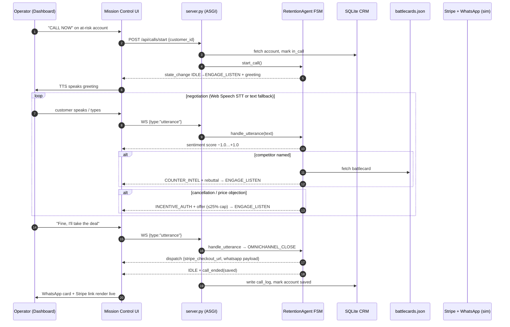

# Churn-Rescue-Agent

**Autonomous outbound retention agent for the CALL-E Hackathon** — detects
cancellation risk, calls the customer, counters competitor objections with
real battlecards, computes an LTV-capped incentive, and dispatches a live
Stripe + WhatsApp retention offer *during the call*.

Pure Python + vanilla HTML/JS/CSS. **No Node.js. No build step.**

## Architecture

```text
┌─────────────────────────────────────────────────────────────────┐
│  Browser — Mission Control (churn_rescue/static/index.html)     │
│  roster │ phone terminal │ FSM tracker │ sentiment │ dispatch   │
└───────────────┬───────────────────────────────▲─────────────────┘
                │ REST + WebSocket (JSON events)│
┌───────────────▼───────────────────────────────┴─────────────────┐
│  churn_rescue/server.py — Starlette ASGI app (127.0.0.1:8000)   │
│  /api/customers │ /api/calls/* │ /ws telemetry                  │
└───────────────┬─────────────────────────────────────────────────┘
                │
┌───────────────▼──────────────┐   ┌──────────────────────────────┐
│  churn_rescue/agent.py        │   │  churn_rescue/db.py          │
│  RetentionAgent FSM           │──▶│  SQLite: customers, call_log │
│  sentiment · intents · offers │   └──────────────────────────────┘
└───────────────┬──────────────┘
                │ reads
        battlecards.json — Salesforce / HubSpot / Linear / Acme
```

## The Voice FSM

| State | Behavior |
| --- | --- |
| `IDLE` | Awaiting trigger. `start_call()` arms the agent. |
| `ENGAGE_LISTEN` | Scores every utterance (−1.0…+1.0 sentiment), classifies intent: competitor / cancel / price / accept / reject. |
| `COUNTER_INTEL` | Competitor named → loads its battlecard from `battlecards.json` and voices the rebuttal with proof points. |
| `INCENTIVE_AUTH` | Computes the LTV-based discount ceiling and voices an escalating offer. |
| `OMNICHANNEL_CLOSE` | On acceptance: mints a mock Stripe Retention Checkout URL and queues a simulated WhatsApp webhook payload, then ends the call. |

### Incentive math (hard cap: 25%)

```text
authorized = min(25, 10 + min(10, ltv / 5000) + min(5, churn_risk_score * 5))
offer ladder = 60% → 80% → 100% of authorized ceiling
```

A $148k-LTV / 0.92-risk account authorizes ~24.6%; a $4k starter authorizes ~12%.
The agent opens at 60% of the ceiling and climbs rungs only under pressure —
margin is protected unless the account is genuinely about to walk.

## Call lifecycle



## Quick start

```powershell
pip install -r requirements.txt   # starlette + uvicorn only, frozen
python seed_customers.py          # 10 enterprise accounts -> data/churn_rescue.db
python -m churn_rescue.server     # http://127.0.0.1:8000
```

Open `http://127.0.0.1:8000`, press **CALL NOW** on a high-risk row, then either
click the mic (Web Speech API STT, Chrome/Edge) or type in the fallback box.
The agent's voice is synthesized with `speechSynthesis`.

### Suggested demo script (as the customer)

1. `"I'm furious — we're canceling and moving to Salesforce, your pricing is a joke."`
   → `COUNTER_INTEL` fires the Salesforce battlecard, then `INCENTIVE_AUTH` opens at ~15%.
2. `"That's still not enough. Acme is half your price."`
   → Acme battlecard + offer climbs toward the 24.6% ceiling.
3. `"Fine, I'll take the deal."`
   → `OMNICHANNEL_CLOSE`: Stripe checkout link + WhatsApp dispatch card pop live.

## API

| Method | Path | Purpose |
| --- | --- | --- |
| `GET` | `/` | Mission Control dashboard |
| `GET` | `/api/customers` | At-risk roster, sorted by churn risk |
| `POST` | `/api/calls/start` | `{customer_id}` → arms FSM, streams events |
| `POST` | `/api/calls/utterance` | `{text}` — REST fallback for utterances |
| `POST` | `/api/calls/end` | Abort active call |
| `WS` | `/ws` | Telemetry + `start_call` / `utterance` / `end_call` messages |

## Verification

```powershell
python -m unittest tests.test_fsm_flow -v
```

Headless simulation of a full angry-customer call — asserts **100% FSM state
coverage**, transition ordering, battlecard selection, discount cap
enforcement, and dispatch payload integrity. No server or browser needed.

## Project structure

```text
churn_rescue/
  agent.py            # FSM engine: states, intents, sentiment, incentive math
  battlecards.json    # competitor intel: Salesforce, HubSpot, Linear, Acme
  db.py               # SQLite schema + helpers (customers, call_log)
  server.py           # Starlette app: REST + WebSocket + static hosting
  static/index.html   # Mission Control dashboard (vanilla JS/CSS)
seed_customers.py     # seeds 10 enterprise accounts
tests/test_fsm_flow.py# headless full-call simulation
requirements.txt      # frozen, pure-Python deps only
```

## Production note (CALL-E integration)

The FSM is telephony-agnostic: `handle_utterance(text) -> events` is a pure
function of transcript text. To run on real PSTN calls, point CALL-E's live
transcript webhook at `/api/calls/utterance` and stream `agent` transcript
events back as the TTS leg — the browser simulation stands in for that voice
path during the demo.
